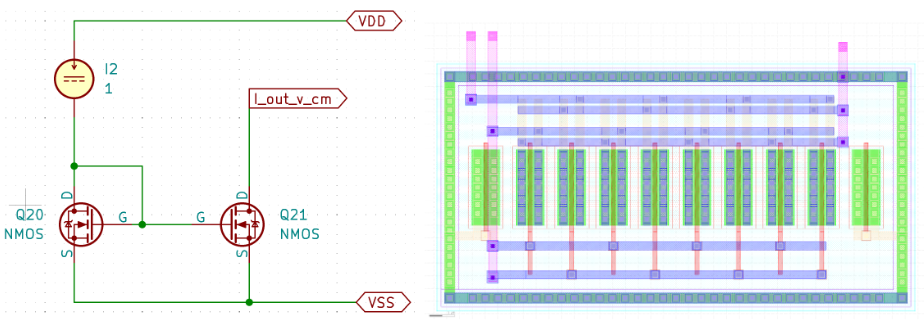
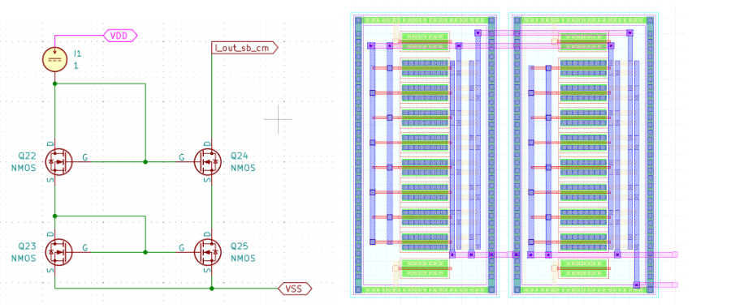
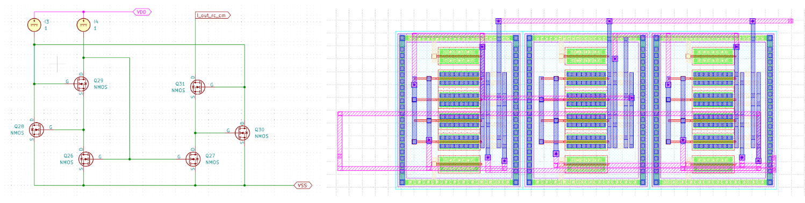
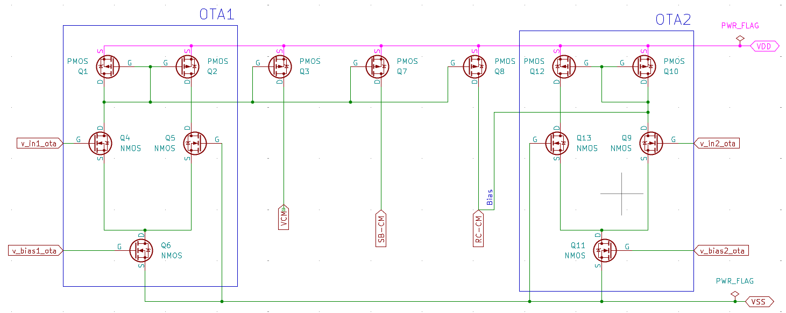
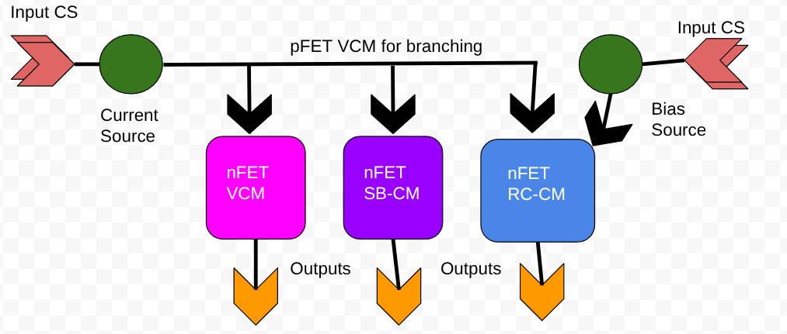
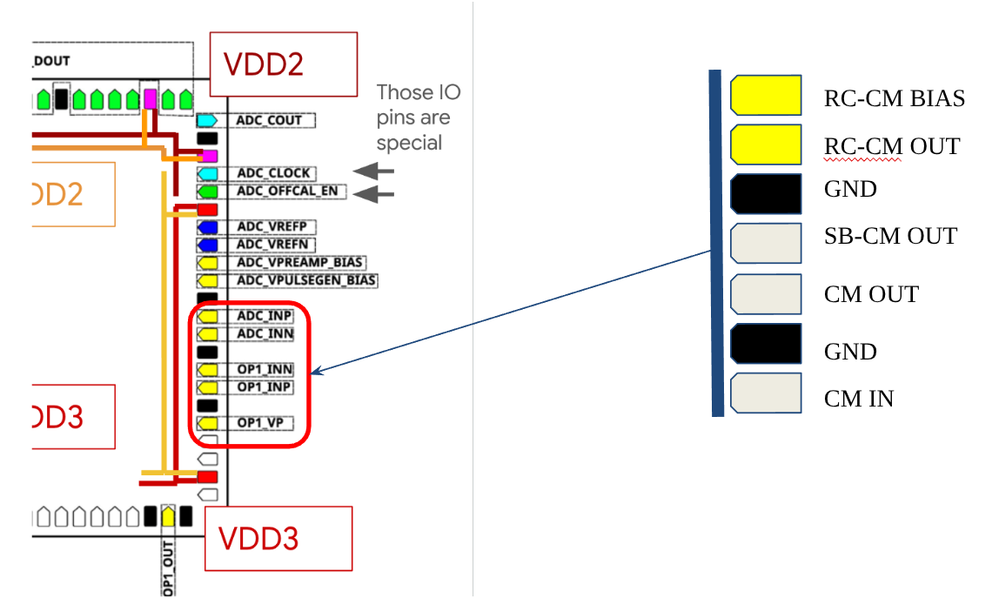
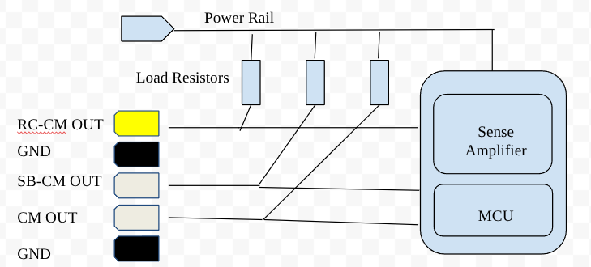

## Team Mahowalders Project proposal, Chipathon 2025
### Project: Towards Biasgen

:point_right: Google Docs [link](https://docs.google.com/document/d/1FZdyJ7MXu66QQ6_0kkzPwPryskKX2VRuOPmt5tDAb5Y/edit?usp=sharing)

**Motivation:** With the rise of analog computation for low-power edge intelligence and sensor systems, the demand for robust bias generation circuits has significantly increased. Bias current sources are fundamental to analog and mixed-signal designs, enabling precise control in amplifiers, comparators, sensor front-ends, and a wide range of other analog building blocks. Ideally, current sources deliver a quasi-constant current when transistors operate in the saturation region, where the output current is largely independent of the drain-to-source voltage. Achieving bias current sources that closely approximate this ideal behaviour is essential to ensure proper circuit operation. However, traditional current mirrors, though widely used, exhibit poor output impedance and limited voltage headroom, which can result in unstable biasing under varying conditions. When the output voltage exceeds the linear range, the current mirror output continues to increase linearly in the saturation region instead of reaching a plateau. This non-ideal behaviour makes such mirrors unsuitable for delivering stable bias currents, often leading to degraded performance in circuits that rely on precise biasing.

**Objective:** This project proposes the automated design and layout of a high-impedance, energy-efficient bias generation block using regulated current mirror architectures. Integrated into the gLayout toolchain (Python2GDS), this design aims to enhance layout portability, stability, and scalability across process corners.

**Design:**  
We compare three bias current mirror architectures: 

* Vanilla Current Mirror (VCM), as a reference  
* Self-Biased Common-Source CM (SB-CM), with improved impedance, moderate complexity  
* Regulated Cascode CM (RC-CM), with high output impedance, better stability, but requires auxiliary bias

All three versions will be parametrically instantiated via gLayout, enabling on-demand generation and automated layout. A testbench OTA stage will be used to convert an input voltage into current, allowing characterisation of each mirror’s response and stability under load.

**Expected Contributions:** 

* gLayout-compatible IP blocks for advanced analog biasing  
* On-silicon testing of all three architectures, with a focus on RC-CM  
* Performance benchmarking and trade-off analysis (stability, impedance, layout area, and bias dependencies)

**Applications:**  
The proposed IP targets analog designs where stable biasing is critical, such as sensor front-ends, neural interface systems, and low-frequency amplifiers. The RC-CM in particular can significantly improve performance in circuits sensitive to bias drift, without requiring extensive overhead. The regulated cascode current mirror provides a more robust stable current source than vanilla current mirrors that are usually used as is in analog circuits using biasin. By using this improved version, a wide range of analog circuits applications such as bias current generators, op-amps or sensor front-end where stable and accurate biasing is crucial to ensure the expected functioning of the circuit can benefit from the improved current mirror.

### **Block: Vanilla Current Mirror (VCM)**  
  
A classical current mirror consists of two transistors: the first Q20 has its drain and gate connected (forming a diode-connected structure) and receives the input current, while the second transistor Q21 mirrors this current at its output. The output current is ideally a scaled replica of the input, determined by the ratio of the transistors' width-to-length (W/L) dimensions.

### **Block: Self-biased Common Source Current Mirror**  
  
The self-biased common-source current mirror uses a feedback mechanism to improve current stability and output impedance. Q22 receives the reference current through a diode connection, setting the gate voltage shared with Q24, which mirrors the current. Q23 and Q25, connected in a common-source configuration, form a self-biasing loop that regulates the source voltage of the upper transistors. This feedback stabilises the gate-source voltage, reducing output current variation and enhancing performance compared to a basic current mirror.

### **Block: Regulated Cascoded Current Mirror**  
  
The regulated cascode current mirror shown uses an auxiliary biasing loop to significantly boost output impedance and current stability. Q26 and Q27 form a standard current mirror, while Q28 and Q30 act as cascode transistors, shielding the mirroring devices from output voltage swings. Q29 senses the drain voltage of Q28 and regulates it via Q31, creating a feedback loop that stabilizes the cascode node. This regulation ensures minimal variation in output current despite changes in output voltage, making the design ideal for precision analog applications demanding high output resistance and improved bias accuracy.

### **Diagram: Proposed Top Integration and Pinout:**   
  
  

### **Pinlist:**

| Pin Name | type | Description | Pin Name | type | Description |
| :---: | :---: | :---: | :---: | :---: | :---: |
| Vin\_OTAI | input | Input of reference current source | Vout\_nVCM | output | Output of nFET VCM |
| Vin\_OTAB | input |  Input of RC bias current  | Vout\_pVCM | output | Output of pFET VCM |
| Vbias\_OTAI | input\* | Bias Input of the reference current source | Vout\_SB\_nCM | output | Output of nFET SBCM |
| Vbias\_OTAB | input\* | Bias Input of RC bias current  | Vout\_RC\_nCM | output | Output of nFET RCCM |

\*Can be potentially merged

#### Alternative Pin-out if Current Sources aren’t necessary, can be provided directly from the PCB.   

  
  

A sense resistor with sense amplifiers and MCU can be used to monitor current output and relative performance of the blocks, spatially, if the same MCU also digitally control the input current generator.

### Questions/Doubts/Suggestions

* Applications \-Integration in larger design  
  * Temperature compensation  
  * Current Source: external or OTA, or simple PolyRes with fixed reference, Diode-connected FETs   
  * Mux’ed Output?   
  * SKY130 to GF180 transition 

### Reference:

1. Michal, Vratislav. "Regulated Cascode Current Mirror with Improved Voltage Swing." 2022 International Conference on Applied Electronics (AE). IEEE, 2022\. DOI : 10.1109/AE54730.2022.9920096  
2. Garde, M. Pilar, et al. "Wide-Swing Class AB Regulated Cascode Current Mirror." *2020 IEEE International Symposium on Circuits and Systems (ISCAS)*. IEEE, 2020\.  
3. Pretl, Harald, and Matthias Eberlein. "Fifty nifty variations of two-transistor circuits: A tribute to the versatility of MOSFETs." *IEEE Solid-State Circuits Magazine* 13.3 (2021): 38-46 and *references therein*  
4. GF180 PadFrame Document: [PADFrame \- Chipathon 2023](https://docs.google.com/presentation/d/12w4WBoleFAE4UePdoUf-bxsZR_BttwY3wknBPPJrEHE/edit?usp=sharing)

### **Team members, Tasks, and Week-by-week schedule**

| Chipathon Week | Task | Team member | Milestone |
| :---- | :---- | :---- | :---- |
| 29,30 | Xschem Schematic Preparation and Testing  | Quentine, Sudhanshu | Uploading xschem block symbols  |
| 29,30 | Pre-PEX  simulation and sizing optimisation | Quentine | Publication of the first sim results and plots |
| 29,30 | Porting of blocks from Sky130 to GF180 and DRC Cleaning | Sudhanshu  | Push of the first DRC clean GDS of blocks |
| 30,31 | LVS Verification | Quentine  | Finalising block GDS |
| 32,33 | **Top Integration / Readiness Check  (August 16, go/no decision)** |  All Members | **Push of the whole Design GDS, pass go/no review** |
| 33,34 | Creating Test-Bench and Post-PEX ngspice simulations |  | Publication of the first Post-PEX sim results and plots |
| 35,36 | Layout Optimization |  | Iterative update to Design GDS |
| 35,36 | Parding Integration |  | Iterative update to Design GDS |
| 36,37,38 | Final testing and Delivery of GDS |  | Communicate and submit GDS |
| 36,37,38 | CACE Integration for Characterisation and Verification |  | Upload the Characterisation report of CACE |
| 39, 40 | Documentation: Design and Testing Procedure |  | Post-mortem, closing Push and acceptance of merge with glayout repo |